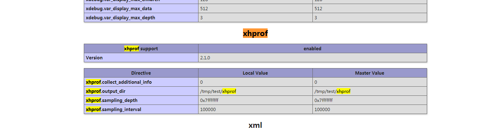
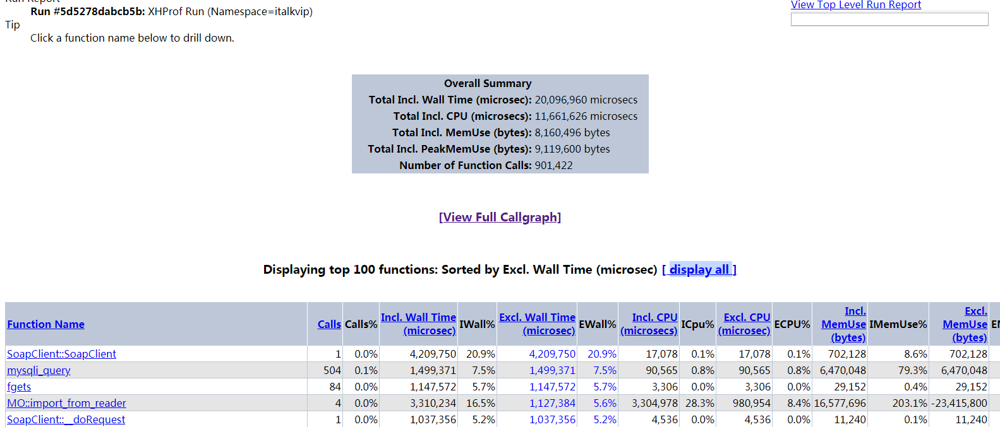

我们用WooCommerce做的电商网站下单耗时比较长，用xhprof分析找到问题优化了一下，现在讲一下过程

### 安装xhprof扩展
由于php版本为php7，xhprof扩展只能去github找
```sh
git clone https://github.com/longxinH/xhprof
cd xhprof/extension
phpize
./configure
make && make install
```

安装完成后 修改php配置文件 添加xhprof配置项
```sh
extension=xhprof.so
xhprof.output_dir=/tmp/test/xhprof
```

<font color="red">注意xhprof 日志输出路径 必须对php用户可写 否则 日志写不进去</font>

然后重启php-fpm，通过phpinfo看到如下图所示 代表安装成功



### 添加分析代码
首先将上一步得到的xhprof源码包中的xhprof_html和xhprof_lib 两个文件夹复制到项目的根目录下

然后在根目录下新建两个php文件  
xhprof_header.php
```php
if (extension_loaded('xhprof')) {
    // 文件的路径需要自己替换
    include_once '/home/hooyes/xhprof_lib/utils/xhprof_lib.php';
    include_once '/home/hooyes/xhprof_lib/utils/xhprof_runs.php';
    xhprof_enable(XHPROF_FLAGS_CPU + XHPROF_FLAGS_MEMORY);
}
```

xhprof_footer.php
```php
if (extension_loaded('xhprof')) {
    $profiler_namespace = 'test';
    $xhprof_data = xhprof_disable();
    $xhprof_runs = new XHProfRuns_Default();
    $run_id = $xhprof_runs->save_run($xhprof_data, $profiler_namespace);
}
```

在需要分析的代码块 头部和尾部分别加上 xhprof_header.php和xhprof_footer.php 

然后执行你要测试的程序，执行完后，会在你设置的xhprof输出目录中出现以xhprof为后缀的日志

### 查看分析日志

访问 http://地址/xhprof_html/ 就会看到日志列表 ，然后点击 ，就会看到分析列表，如图

图中字段说明：  
Function Name：方法名称  
Calls：方法被调用的次数  
Calls%：方法调用次数在同级方法总数调用次数中所占的百分比  
Incl.Wall Time(microsec)：方法执行花费的时间，包括子方法的执行时间（单位：微秒）  
IWall%：所占的百分比  
Excl.Wall Time(microsec)：方法本身执行花费的时间，不包括子方法的执行时间（单位：微秒）  
EWall%：所占的百分比  
Incl.CPU(microsecs)：方法执行花费的CPU时间  
ICpu%：所占的百分比  
Excl.CPU(microsec)：方法本身执行花费的CPU时间  
ECPU%：所占的百分比  
Incl.MemUse(bytes)：方法执行占用的内存  
IMemUse%：所占的百分比  
Excl.MemUse(bytes)：方法本身执行占用的内存  
EMemUse%：所占的百分比  
Incl.PeakMemUse(bytes)：Incl.MemUse峰值  
IPeakMemUse%：所占的百分比  
Excl.PeakMemUse(bytes)：Excl.MemUse峰值  
EPeakMemUse%：所占的百分比  

然后点击[View Full Callgraph] 就可以看到耗时效果图


### 分析耗时程序
通过分析日志 我们找到了耗时程序curl_exec(),占用了总耗时的73.4%  
商城下单完成的同时会异步调用几个接口，异步调用实现的代码如下：
```php
$args     = array(
    'headers'  => $headers,
    'timeout'  => 30,
    'body'     => $post_str,
    'blocking' => false,
    'cookies'=>$_COOKIE
);
$response=wp_remote_post($url, $args);
```
通过将blocking设置为false，来实现异步调用。  
通过跟踪源码发现curl实现异步调用有问题，于是将异步访问接口改成了fsockopen，耗时问题解决了  
关于php异步调用的介绍：[php异步调用](http://www.laruence.com/2008/04/14/318.html)


